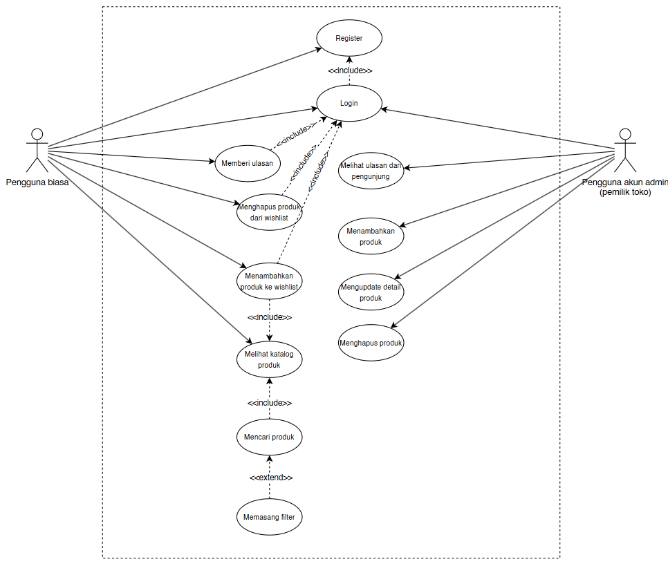
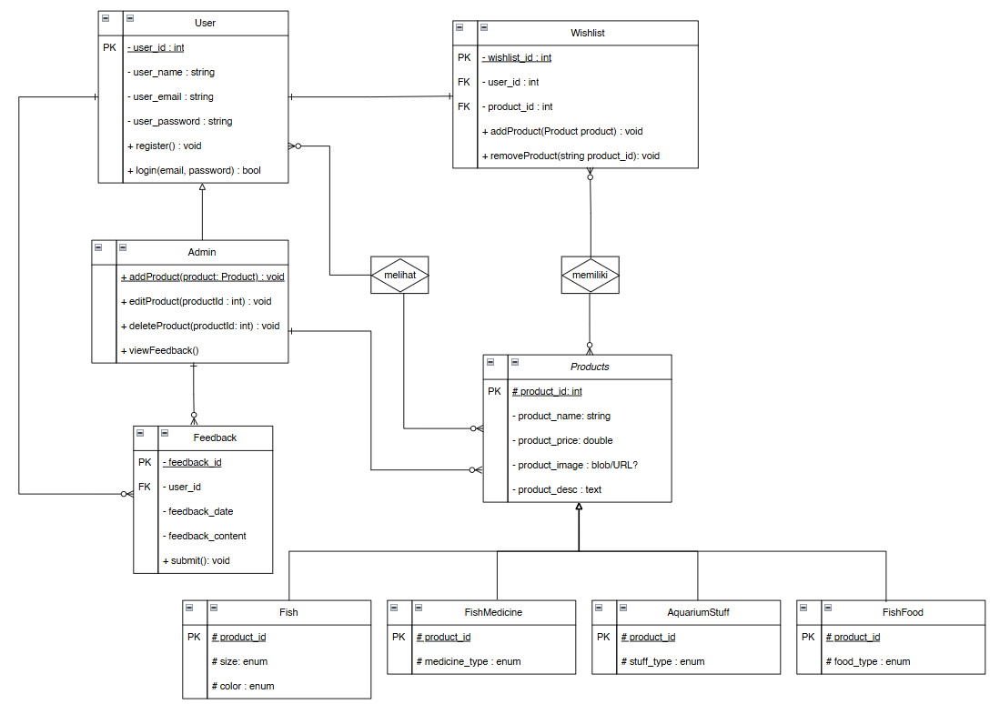
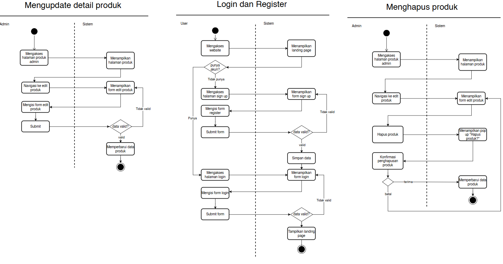
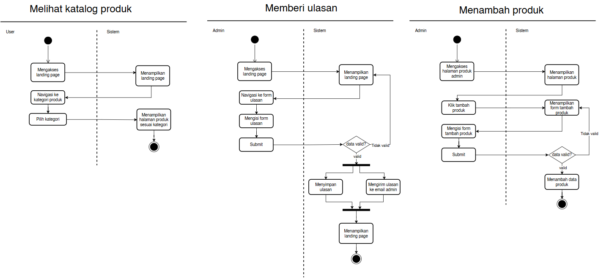
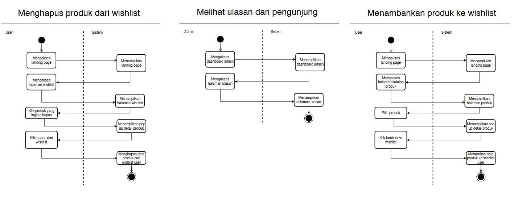
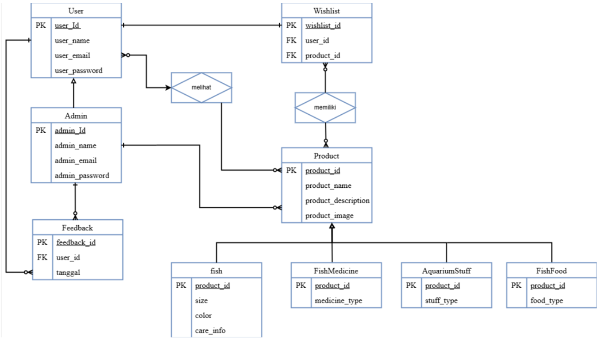

# Waluya Akuarium - Website Promosi Toko Ikan

## Tentang

Waluya Akuarium adalah website promosi yang didedikasikan untuk memperkenalkan toko ikan Waluya Akuarium. Website ini bertujuan untuk memberikan informasi lengkap tentang berbagai jenis ikan hias yang tersedia, fasilitas akuarium, serta berbagai produk terkait akuarium yang dapat dibeli di toko. Platform ini bertujuan untuk memudahkan pelanggan dalam menemukan informasi yang mereka butuhkan terkait akuarium dan ikan hias dengan tampilan yang user-friendly.

## Tim Kami

- **Aisyah (G6401221017)** - Backend Developer, Website Integrator
- **Budi (G6401221006)** - UI/UX Designer, Frontend Developer
- **Citra (G6401221094)** - UI/UX Designer, Frontend Developer

## Diagram

### Diagram Use Case (Use Case Diagram)

### Diagram Kelas (Class Diagram)

### Diagram Aktivitas (Activity Diagram)

### Diagram Entitas Relasi (ERD)

## Fitur

### Website

### Kode

## Teknologi yang Digunakan

- **Frontend**: HTML, CSS, JavaScript 
- **Backend**: Django
- **Database**: DQLite
- **Version Control**: Git
